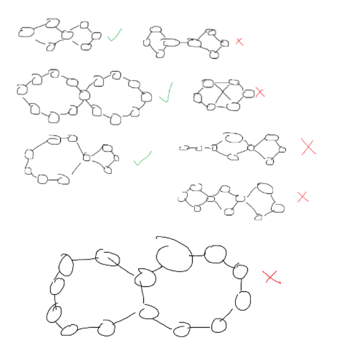

[kb_limit: 256000]
[ms_limit: 1000]
[rating: 130]
[creation: 2023-08-21T16:00]

Mugs is at Wilson Park, where he is travelling in the underground burrows. The burrows are connected by a network of tunnels, each of which is a straight line. Formally, there are $1 \le N \le 10^5$ burrows, connected by $1 \le M \le 10^5$ tunnels. Each tunnel connects two burrows, such that the resultant graph is simple (no duplicate edges or self loops).

Mugs has been travelling on the burrows, and feels like the burrows go on forever! In fact, he is curious if the burrows actually form an infinity symbol (two cycles joined by a single vertex). Below depicts positive and negative examples of infinity symbols. Given the specified burrow network, output whether or not the graph forms an infinity symbol. 


# Input

The first line contains the integers $N$ and $M$. The next $M$ lines contain two integers $a_i$ and $b_i$, indicating that there is a tunnel between burrows $a_i$ and $b_i$.
# Output

Output one line, `YES` if the burrows form an infinity symbol, and `NO` otherwise.

# Example
```in
5 6
1 2
1 3
1 4
1 5
2 3
4 5
```
```out
YES
```

The burrows form an infinity symbol

```in
6 7
1 2
1 3
1 4
1 5
2 3
4 5
5 6
```
```out
NO
```

The burrows do not form an infinity symbol since they have an extraneous trailing edge.

Problem Credits: Manu