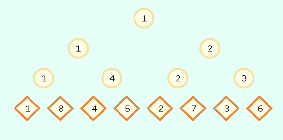

[kb_limit: 256000]
[ms_limit: 1000]
[rating: 140]
[creation: 2023-08-21T16:00]

Mugs and Alice have been watching a lot of wrestling matches lately. They have been watching so much wrestling that they have decided to start their own wrestling league! The two have already recruited $1 \le N \le 10^5$ rabbits to join their league. Conveniently, $N = 2^K$ for some integer $K \ge 0$.

To prepare for the tournament, they must create a tournament bracket! Formally, we can represent the tournament as a perfect binary tree with $2N - 1$ nodes. Then, our aim is label the leaves of the tree such that the following conditions are satisfied:

1. Each bunny is labelled with a distinct number from $1$ to $N$.
2. For any two bunnies $a$ and $b$, if $a$ is labelled with a number less than $b$, $a$ and $b$ both win their first $k$ matches for some non-negative integer $k$, and both bunnies were always facing a higher numbered bunny than than themselves in the first $k$ levels, it must be guaranteed that in the $k + 1$th level, the opponent of $a$ will be a higher number than the opponent $b$.
3. For any two bunnies $a$ and $b$, if $a$ is labelled with a number less than $b$, $a$ and $b$ face each other in the $k$th match, and both bunnies were always facing a higher numbered bunny than themselves in the first $k -1$ matches, it must be guaranteed that in the $k$th match, $a$ is the left child of the match and $b$ is the right child of the match. 

It can be shown there is a single labelling of leaves that satisfies the above rules. If that was too technical, perhaps try taking look at the examples and see if you can derive the rules from there.

Here's a figure with $N = 8$:



# Input

The first line contains a single integer $N$. It is guaranteed that $N = 2^K$ for some integer $K \ge 0$. 

# Output

Output one line, a permutation of $1 \ldots N$ that satisfies the above rules and represents the labels of the $N$ leaves. 

# Example
```in
2
```
```out
1 2
```
Trivial example.
```in
4
```
```out
1 4 2 3
```
Note that we could not have $1, 2, 3, 4$ since then $1$ would be facing a lower number than $3$ in the first match, which violates the second condition. We can also not have $3, 4, 1, 2$ since then if $1$ and $3$ win the first round, $1$ would be the right child in the next match, which violates rule 3.

```in
8
```
```out
1 8 4 5 2 7 3 6
```
See the figure above for a visual representation of the output.

Problem Credits: Manu (sort of canonical example). Tested by Jiaming.