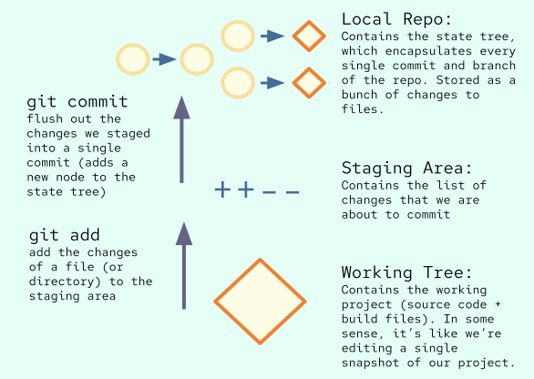

[author: Manu]
[creation: 2023-08-19T16:00]

This is a tutorial meant to get you comfortable with Git. See [Git Reference](/text/Man%20Pages/Git%20Reference.md) for a list of idioms and commands.

What is Git? Git is a command line utility used for two important (but related) purposes: version control and syncing files between different computers. Git is ubiquitous when it comes to development, though other version control systems do exist. While many IDEs have Git integrations (JetBrains in general does a really great job), I recommend you follow along with the command line to get comfortable with it. Let's get started!

# Part 0: Accounts

Even though Git is a stand-alone utility that works as version control system, to publish projects and/or have multiple people work on them, we need a web server to help us out. We'll be using GitHub, but tons other exist.

First, create an account on GitHub. I recommend using your personal email address as your primary (but you can add your student email as a secondary address to get a whole load of benefits). Then, navigate to `User Icon > Settings > Emails` and enable the 'Block command line pushes that expose my email' option. This will prevent your email from being exposed in commits. Keep a note of the private email GitHub created for you (e.g. `43832426+enigmurl@users.noreply.github.com`). Finally, scroll to `Developer Settings` and create a new personal access token. For now, just enable all options, but keep in mind you'll want to use a more limited set in the future. Keep a note of the token it gives you, as we'll need it later. 

Now, we somehow need to tell Git (on our local machine) about the account we created. This is what the token is for! Anyways, we'll use the `git config` command to help us out here. Run the following commands in a shell of your choice, replacing the values as appropriate:

```bash
git config --global user.name "<Your GitHub username e.g. enigmurl>"
git config --global user.email "<Private Email e.g. 43832426+enigmurl@users.noreply.github.com>" 
git config --global user.password "<Personal Access Token (NOT your GitHub password)>"
```

The `--global` option basically just tells Git that we want these settings to apply to every repository (project) we create, rather than just the current one.

We now have our GitHub account fully set up! Let's move on to creating our first repository.

# Part 1: Motivation and Git Basics

What even is a version control system (VCS) and why do we need one? Even though you might be able to get away with just coding directly in an IDE on smaller projects, this doesn't really scale. What if we mess something up and want to revert to a previous version of our project? What if we want to work on multiple features at once? What if we want to work on a project with other people? This is where Git comes in.

Let's get comfortable with some terminology you'll often hear. 
- A *repository* (hereafter repo) is essentially just a single project (e.g. a single website, a single game, etc.). If it helps, you can think of it as a project has an associated git repo. 
- A *branch* is a distinct 'lineage' or version of our project. For example, you might have a `main` branch that contains the latest stable version of your project, and a `dev` branch that contains the latest features you're working on. Different branches are related in that they are working on the same project, but differ in the exact feature set they have. 
- A *commit* is a single change to our project. For example, if we add a new feature, we might commit that change. If we fix a bug, we might commit that change. 

Commonly, a repo is depicted as a tree. Here's an example


Let's use our graph theory knowledge to connect the tree to git. Inner nodes represent previous commits (or previous states of the repository), and edges represent the transaction between states. That is, an edge represents the files you modified from one snapshot of the repo to the next. The root node is the initial commit, and the leaf nodes are the latest commits. Branches are essentially just pointers to a leaf node.  

Now that we have a rough idea of what Git is, let's create our first repo! First, create a new project in CLion called `git-tutorial`. We'll be writing a mock `ls` (list directory) cli. Do *not* select any options that'll manage git for you, we want to do the hard work ourselves! On CLion's terminal (bottom left), run the following command to initialize a new git repo. After running this command, you'll have a `.git` folder in your project, where git will manage the repo.

```bash
git init
```

Okay great, we have a git repo associated with this project, but now what? Well, first let me introduce the topics of the working tree, staging area, and local repo. The working tree is pretty easy: it's just the actual project and associated files. The staging area and local repo, on the other hand, are managed by git. Below is a diagram of the three concepts. Feel free to look back throughout the rest of this part.



## naive-vcs
For motivation, let's say you were writing a version control system `naive-vcs`. A naive implementation might look something like having the working tree (remember: just the project directory and related files) as it is, then whenever we make a significant change, we run `naive-vcs snapshot`, which would create a full copy of the working directory and save it along with a timestamp. Essentially, `naive-vcs` is just a smart backup manager. Let's see how we can improve this. 

For one, it's wasteful to save an entire copy of the working directory when we're probably only making minor changes between 'snapshots.' Secondly, we might not want our vcs to even care about every single file in our working directory. For example, we might have a `build` folder that contains compiled binaries. A snapshot in a VCS is meant to be the minimal amount of information that encompasses the entire state of the project. Including compiled binaries is redundant, and in some sense is distracting. For similar reasons, we typically may *list* third party dependencies in our VCS, but not actually include the files (which could also be quite large, and thus wasteful to store). 

As a general rule of thumb, a file should be included in the VCS if it is necessary for every developer to build the project from scratch, and cannot be derived from other files in the project (so user-specific config files, compiled binaries, third party libs are typically excluded).

## Git's Solution
Ok, finally this brings us back to git. To solve the first problem of wasteful storage, git keeps track of changes (e.g. lines inserted, lines removed, files deletes, files renamed, etc) to the working directory. The second problem is tackled in a couple of different of ways. For one, you can have a .gitignore file that lists files that we need in our working tree for the code to run, but are not important for the VCS. Let's do that right now for our project. Create a file called `.gitignore` in the root of your project, and add the following lines:

```.gitignore
cmake-build-debug/
.idea/
```

For now, these are the only lines we need. This tells git to basically pretend the `cmake-build-debug` folder doesn't even exist, which is where CLion stores compiled binaries. The `.idea` folder is also for IDE related stuff, which we don't need to track.

Anyways, remember the local repo? This is where git will keep track of the different versions. But then what's the staging area for? For motivation, even with `.gitignore`, there might be reasons that you don't want to include all the changes you made in a snapshot (hereafter, commit). For one, all changes made in a commit are supposed to be related to a common goal (e.g. Update PlayerController to allow wasd movement in addition to arrow keys), and you might have made changes that are unrelated to that goal (e.g. fix a typo in a comment in OceanController.cpp). It would be unwise to include the two  changes in the same commit because now the commit has two different purposes. Instead, we want to selectively choose which changes to include in a commit. This is where the staging area comes in.

Fundamentally, we could just list out every single file we want included in the commit on a single line. For instance, hypothetically we could have something like (not actual syntax):
```bash
naive-vcs commit -m "Update PlayerController to allow wasd movement in addition to arrow keys" \
    PlayerController.cpp KeyboardHandler.cpp Player.cpp
```
The problem with this is that there might be a lot more files, and it would get rather confusing to have this all in a single command. Thus, we have a staging area. This essentially just lets us type out the files we want to include in a commit over multiple commands. Once we finish adding all the files, we can then 'flush' the changes by actually committing. The staging area is really just a list of the files (or really, the changes in the files) we want to include in the next commit. The above would get translated into something like this (actual git syntax, but of course we dont' have the files yet, we'll do it on our actual repo in a sec):
    
```bash
# 'add' the changes we made in PlayerController.cpp, KeyboardHandler.cpp, and Player.cpp 
# to the staging area in preparation for our next commit
git add PlayerController.cpp
git add KeyboardHandler.cpp
git add Player.cpp
# now that the staging area has the changes we want
# flush the changes using commit
# the '-m' flag is a required option that specifies the commit message 
# (i.e. what is this commit about)
git commit -m "Update PlayerController to allow wasd movement in addition to arrow keys"
```
We could actually do this more simply using `git add .` (you can add the changes of entire directories!), but I wanted to illustrate the point of the staging area. Anyways, lets get back to our project by issuing the Initial Commit! Currently, our working tree looks like the following:
```text
git-tutorial
      .gitignore
      CMakeLists.txt
      main.cpp
      cmake-build-debug
```
In the initial commit, we want to add all the relevant files in the working tree to the staging area, then commit them. Let's do that now:

```bash
# stage relevant changes 
# (by specifying the filenames for which the changes occurred in)
git add CMakeLists.txt
git add main.cpp
git add .gitignore
# before committing, it might be helpful to ensure
# the staged area is what we want, we can use git status for this
git status
# looks good! lets commit
git commit -m "Initial Commit"
```
Yay! Our first commit. From here, if we make future modifications, we can add another commit. Remember, the changes we are talking about are relative to the last commit. Right now, we know the following commands:
- `git init`: initialize a new git repo
- `git add`: add changes to the staging area
- `git status`: check the status of the working tree, staging area, and local repo. Helps us make sure we're committing what we want to commit!
- `git commit`: commit the changes in the staging area to the local repo

Hopefully, you're realizing the merit of git. Your goal when reading this tutorial is to understand why we do things the way we are doing them, and why git is designed the way it is. Moreover, always try to see why we even need a version control system; why go through all this effort; what value does it bring us? This will help you understand the commands and concepts much better.

## Caveats

Some stuff I've said is not entirely correct. For instance, git doesn't actually store diffs the majority of the time. This [blogpost](https://alexwlchan.net/a-plumbers-guide-to-git/) is a pretty good summary of the internals, and I recommend reading for further information. Also, branches don't necessarily point to leaves, but I think that's an easier interpretation coming from a competitive programming perspective.

# Part 2: Remotes, Branches and Merges

Remotes, Branches, HEAD, Orphan Branches, and Detached HEAD. Resolving merge conflicts. Might want to split into another part?

# Part 3: History and Time Travel 

Git switch detached? Maybe stashes here? Undoing mistakes is very important.

# Part 4: Pull Requests and General Idioms

Pull Requests, GitHub issues? Feature branches, merge conflicts, rebasing, squashing, etc. More detailed gitignore stuff.

# Part 5: Advanced Git Features

Rebase, bisect, cherry-pick, submodules, reflog, blame, worktree, not sure if we'll have time for all that.
